# Grand Challenge: Complete (and Robust) Wearable

## Tutorial 1: Circular Buffer

>Q1: Show the code: Create a circular buffer (NumPy array) of size 5 and initialize it to zeros. Then add the following four 3-sample arrays (NumPy arrays) in order, one at a time:

[10, 12, 1],  [3, 19, 23], [24, 5, 78], [29, 13, 4]

Show the circular buffer at every step. Note that the maximum length of the buffer is 5! The insertion operation must not increase the size of the buffer, so be careful. Your output should look like this after each insertion of the 3-sample arrays:

[ 0  0 10 12  1]
[12  1  3 19 23]
[19 23 24  5 78]
[ 5 78 29 13  4]

>A. 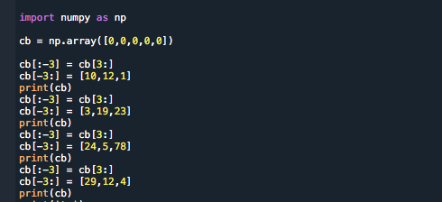

>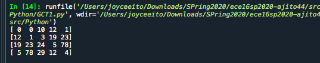

>Q2: Show the code: Create a 2D circular buffer (NumPy array) of size (2, 3) and initialize it to zeros. Then add the following four 3-sample arrays (NumPy arrays) in order, one at a time:

[10, 12, 1],  [3, 19, 23], [24, 5, 78], [29, 13, 4]

Show the circular buffer at every step. Note that the maximum size of the buffer is 2x3! The insertion operation must not increase the size of the buffer, so be careful. Your output should look like this after each insertion of the 3-sample arrays:

[ 0  0 0]
[ 0  0 0]

[ 0  0 0]
[ 10, 12, 1]

[10 12 1]
[3 19 23]

[3 19 23]
[24 5 78]

[24 5 78]
[29 13 4]

>A. 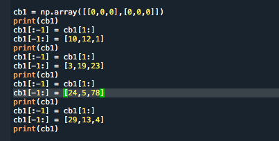

>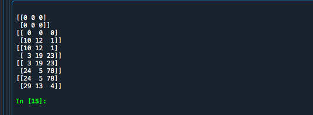

## Tutorial 2

>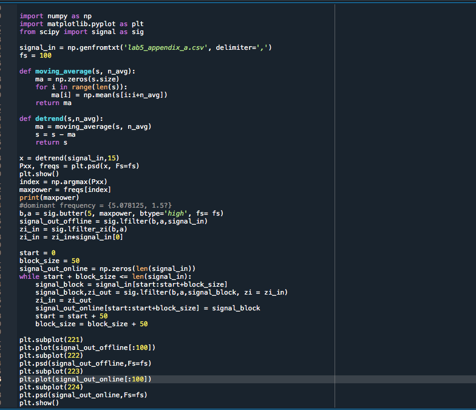

>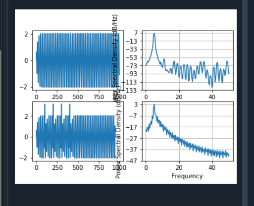

>Compare the plots for the two approaches. Do you see a difference between the two? And if so, why do you think that may be?

>A.Between the plots, there is a difference, especially with the psd plots. I think the psd plot for the signal_out_online is smoother in a sense because it goes through the data little by little(in this case, 50) so it can average it out better. 

## Grand Challenge #1: Complete Online Wearable! 

>For the Grand Challenge, I changed the way I filtered the data for the heartrate and pedometer data. To do this, I created two new functions in the Pedometer and ppg classes. The onlyonce functions is used to create a highpass filter, compute the coefficients,and then compute the initial conditions. The lfilter function is where I incorporated the code to simulate an online system, updating the initial conditions continuously
. From the pedometer class, the self.filtered_data = signal_out_online. From the ppg class, the self.signal = signal_out_online. The onlyonce functions returns b,a, and zi_in because those variables are needed for the lfilter function. The lfilter functions returns zi_in because zi_in is constantly changing. In the Connection class I revised receive_data, I added the circular buffer logic given to us from the lab(including a maxlen, making sure the data moves one row up when it reaches maxlen). In the Wearable class, I created two new functions, samples and GrandChallenge. In the samples function, it basically does what collect_data function does but instead of going up to 500, it collects data continuously also, making sure the data never stops going in. I created an increment i = 0, made a while loop where i < num_samples, then made sure the data was being read, and the i being incrememted by 1 all the time. It would only stop reading if there was a keyboard interrupt. The GrandChallenge function opens the serial port/starts streaming the data. I then created a count variable (count =0) because I needed the onlyonce function to happen, well, only once. First a while True statement was created. From there I called my samples function and made num_samples 100*32 because if it was just 100, it would calculate the heart rate and stepcount after every three samples, and multiplying it by 32 made it calculate the heart rate and stepcount around every 100 samples(which is 2 seconds worth of data). Then we store the data into the data_array. From there we call the ppg and pedometer classes so it can read the ppg data and accel data. In a if count == 0 statement, I make the variables b,a,zi_in, and c,d,zi_in2 equal the onlyonce functions, and after that increment count. After the if statement, there is an else statement that first calls the lfilter function for ppg, plots the signal vs time, calls the calculate heartrate function, then prints the calculated heart rate in the oled and monitor. Then it calls the lfilter for the pedometer class, calculate the step_counts, plot the filtered data vs time, and finally prints the step count to the oled and monitor. Finally in the main function, I call the Wearable class, set the port to my bluetooth, and then call the GrandChallenge. 

>

>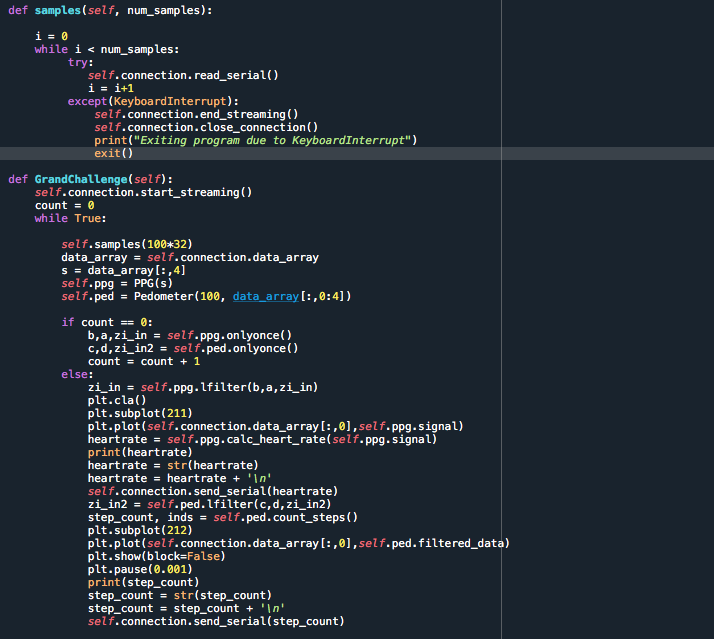

>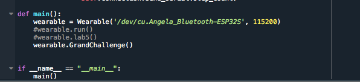

>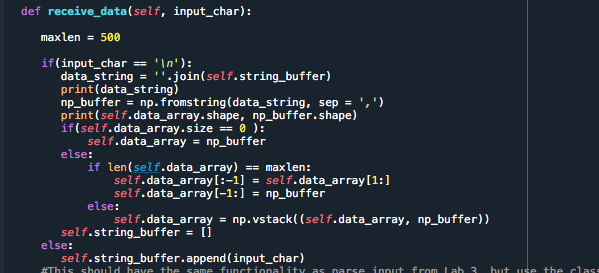

>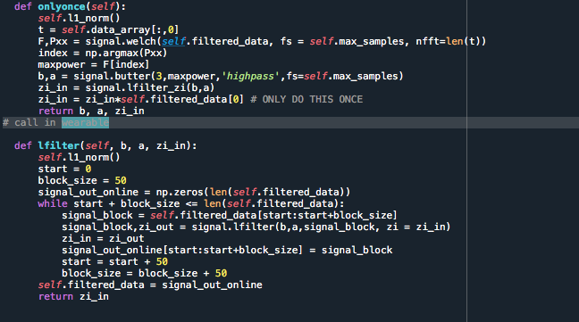

>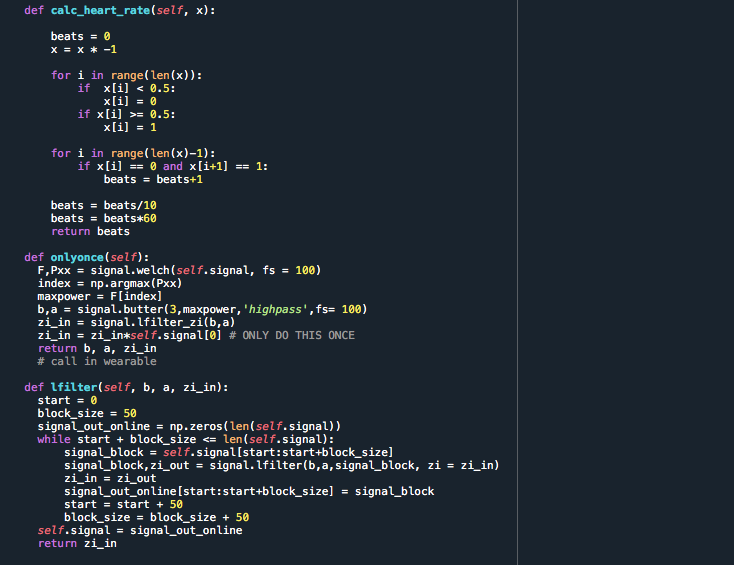