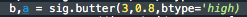
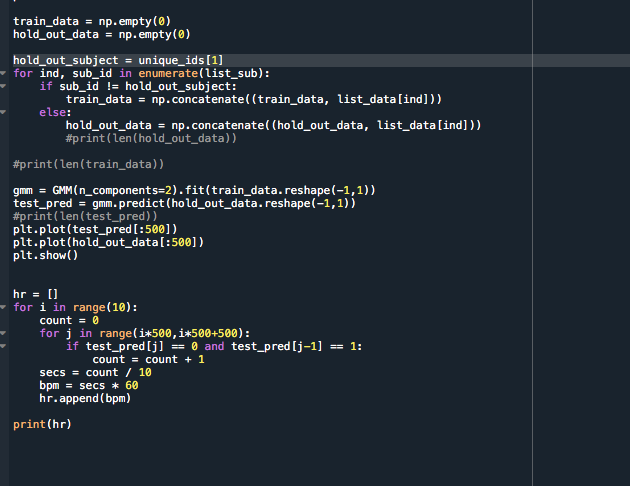

#Lab 5:Smart (ML) Wireless Gesture Controlled Heart Rate Watch & Pedometer

##Tutorial 1
>Q1. If the sampling rate was 120 Hz, what would be the maximum observable frequency component of the signal (the Nyquist frequency)?
>A. The maximum observable frequency is 60Hz.

>Q2. If the signal bandwidth is composed of 0-10 Hz, what is the minimum sampling rate that will capture this signal based on the Nyquist Sampling Theorem? What would be recommended in general practice however?
>A.The minimum sampling rate has to be at least twice of the sample frequency so the minimum would be 20 Hz. In general practice, it is recommmended to sample at least four times more than the highest frequency.

>Q3. How does the detrend function modify the frequency content of the signal? Show the plot and circle the part that is most modified and explain why. Be mindful of the y-axis limits.
>A. Filtering the signal makes the signal average closer to zero. Since the filtered signal is closer to zero, the graph at the DC offset 0HZ will have a smaller PSD value.
>>

>Q4. Show the code - Use np.argmax() to find the actual dominant frequency of the x-axis acceleration (currently labeled as 1Hz in the above plot). The aim here is to use argmax to get the index of the maximum value of Pxx and then use that index to get the corresponding frequency in Freqs. Try this with and without removing the DC offset. What do you get?
>A. When I removed the DC offset, the actual dominant frequency of the x-axis acceleration is 1.8 Hz. When I didn't remove the DC offset, the dominant frequency is 0 Hz.
>>

>Q5. If we don’t remove the DC offset first, how can we index Pxx such that when we calculate argmax, we don’t look at the Pxx[0] (skipping the 0 index)?
>A. To indec Pxx so that we don't look at the Pxx[0], just remove the index from the array using the delete function.

>Q6. What is the dominant frequency for the y and z acceleration in the sample?
>A. for y, df = 1.9 Hz. for z, df = 2Hz

>Q7. Show the code: Looking at the documentation for signal.butter(), make a 3rd-order lowpass filter with a cut-off of 0.8Hz.
>>

>Q8. Of the previous time-based filters in Lab 4, which filter is most like the lowpass filter?
>A. moving_average is most like the lowpass filter because it takes the average of a certain amount of points in the signal, therefore making the filtered signal have less data than before, making the frequency lower.

>Q9. Show the code: Looking at the documentation for signal.butter(), make a 3rd-order highpass filter with a cut off of 0.8Hz.
>>

>Q10. Of the previous time-based filters in Lab 4, which filter is most like the highpass filter?
>A. detrend is most like the highpass filter

>Q11. Build a 3rd order lowpass filter with 5Hz cutoff and a 3rd order highpass filter with 0.5 Hz cutoff. Show: (1) Original signal from Appendix A, (2) Original signal PSD, (3) lowpass filtered signal, (4) lowpass-filtered PSD, (5) highpass-filtered signal, and (6) highpass-filtered PSD.
>>

##Challenge 1
>For this challenge, I had to collect accelerometer data and turn it into pedometer data using the Connection class. To do this, I first saved pedometer data and then filtered the data. Then I had to find the dominant frequency component, make a low pass filter, take the gradient of the signal, and then plot the filtered signal and the PSD of it. 

>>

##Challenge 2
>For this challenge, I added on to challenge 1 to find the number of steps that I was taking. I learned to use the SCiPy Library to find the peaks of the signal. I also had to choose a specific threshold so that I wouldn't count unnecessary data. Using the code, I was able to plot the data and peaks, and find the number of steps i've taken from the data I had.

>>
>>

##Challenge 3
>For challenge 3, I had to put everything together through OOP classes. I had to create a pedometer class. Then I added a function to Visualization and put it all together in Wearable. In Wearable, the code is able to read the data, filter the data, plot the data, and output it on the oled. The pictures below show my OOP codes.

>>
>>
>>

##Tutorial 2

>Q1. What is the correct regex to get trial “0” for any subject given our naming convention ID_Trial_HR.csv”. 
>A.The correct regex to get trial "0" is to code it like the following, after the directory/name/data/ *_01_*.csv” (note that 01 is trial 0)
>>

>Q2. Attach a snippet of your code and briefly describe the logic you’ve used.
>A. So basically I wanted to try to do the one liner code and to do that, I had to go through so many different websites just to find out how to do it. So first I looked up list comprhension in python and I noticed an example where you can use a for loop, and decided to implement it into my code so that it would read each file in the list. From there, I decided to split the elements of the list so that I can separate the file names from the whole directory, and then the unique id from the underscore. From there, when I would print out the unique_id it would show me multiple of the same id's since there are multiple files for the id. So I decided to look up a code that removes the duplicates and that's where OrderedDict.fromkeys comes into play. Then to sort the unique_id's in numerical order, I used the sorted function.
>>

##Challenge 4
>For this challenge, I learned how to split the data into subjects. From there I was able to read the data from the Training folder, filter the data, and then store it into the list data.

>Q1. According to the lecture, what is a recommended split between training and testing on a small dataset? 
>A. 70% training set, 15% testing set, 15% validation set

>Q2. Why is it important to split on subjects and not to treat each file as an independent sample?
>A. It's important to split on subjects and not to treat each file as an independent sample because the subjects are not created equal since the data has different reference heart rate.

>Deliverable
>Code
>>
>Output of list_ref
>>

##Challenge 5
>For this challenge, I learned about Gaussian and Gaussian Mixture Model and how it can determine the threshold to calculate heart rate. To do this challenge, I used the code snippet to get the Gaussian Mixture Model by holding out one subject. From there, I was able to calculate the heart rate for the data. 

>On the histogram plot, sketch two Gaussians on top of the histogram. 
>>
>>

>Q1. What is the difference between leave-one-out validation and leave-one-subject-out validation? Which are we doing and why is this important? Why would it be an issue if we used the other validation method given what we are building? 
>A. The difference between leave-one-out and leave-one-subject-out is that leave-one-out is where we use one subject and leave out one of the data files, while leave-one-subject-out is where we have multiple subjects and leave one whole subject out from the rest. We are doing the leave-one-subject-out because again, the subjects are not equal. There would be an issue if we used the other validation method given because it'll only be going through such a limited amount of data so it wouldn't be as accurate.

>Deliverable
>>
>>
>>
>Heartrate of unique_id = 2
>>

##Challenge 6
>For this challenge, I had to take everything I coded and turn it into OOP. The final product will result in a ML Heart Rate Calculater using OOP.

>part of my oop code cause I couldn't figure it out on time
>>
>>

>part of my test_hr_model, not completed or right because I can only get the first set of data to be the 2d array I want. I can't exactly figure out how to make it a 2d array.
>>

>what i put in wearable
>>
