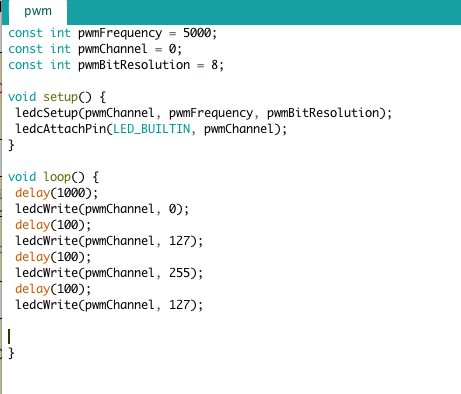

# Lab 2: Gesture-Controlled Watch

## Tutorial Part 1

> Digital Write

>Q. What is the frequency of the blink rate in this example? Note that frequency is the inverse of the time it takes for a cycle. A cycle is the time it takes to go HIGH to LOW to HIGH again. Record a video of your ESP32 blinking. 

>A. Frequency = 1/1500ms = 1/1.5s = 0.67Hz

> Digital Read

>Q. Why do we need a pull-up resistor? Describe the behavior without it.

>A. We need a pull-up resistor because it helps determine if the pin is high or low. Without the pull-up resistor, the program would not be able to tell what state the pin is in. 

> LED

> Q. Which GPIO pin did you have to use according to the above setup?

>A. 32

>Q. What is the expected current draw? 

>A. 0.01 A

>Q. What is the current limit for the GPIO?

>A. 40mA

> Serial Write

>Q. In your report, run the above code at Baud Rate of 9600. How many seconds are between each Hello World? What did you expect the time between each print statement to be and what did you actually get? 

>A. Between each Hello World, it seems to be less than 1ms. I expected the time between each print second to be around 1ms because of the delay that was put into the code but it seems to be a little faster than that.

>Q. How does this change when you change the baud rate to 2400, 4800, and 115200?
>When you change the baud rate to 2400, it becomes extremely fast,probably about 1/4 the time for the 9600 baud rate. When you change the baud rate to 4800, it's still faster than the 9600 baud rate, probably about 1/2 the time it takes for the 9600 baud rate. When you change the baud rate to 115200, it becomes extremely slow, probably about twelve times more time to print the statement. 

> Creating New Project File Tabs

>Q. Note the tabs shown in the figure (for Button, LED, Message, and Timer). Please create these four tabs in your sketch.

>A.

## Challenge 1: LED Blink Frequency 
> In this challenge, we set up three LEDS(red, yellow, and blue) and gave them different blink frequencies. First, I had to decide the resistor values to use for the LEDS. Then, I had to code the specific conditions given to change the frequencies of the built in LED and the set up LED's. After compiling the code and uploading it to the board, the LED's started to blink from red, yellow, to blue. 

>Q. What are the resistor values you chose for each of the LEDs?

>A.For the red and yellow resistor, I chose the 220 ohms because the voltage for a red and yellow resistor is around 2.2V. For a blue LED, the voltage is around 3.3V so I chose a 470 ohm resistor because I have no resistor in that's a 330 ohm. 

>Q. Videos showing each condition (please record in landscape-horizontal mode)

>A.
>
>
>

## Challenge 2: Timer - Part 1 
> In this challenge, we set up a button that when you press it, a timer will run. To do this challenge, we had to first connect the button to the board using pin 14. Then we had to code the button function to make it work, the timer button to get the time, and then the message button to make it show up on the serial monitor.

>Q. What is the average time elapsed for each second iteration? Use millis() to help you with this task. Describe how you measured this.

>A. The average time elapsed for each second iteration is 1000 ms or 1s. To measure this, I used two variables with millis() and subtracted the first variable from the second variable, only after the timer started though. 
>

## Challenge 3: Timer - Part 2
> In this challenge, I just added more to the code for the timer to make the timer go back to zero when I let go of the button. To do this, I just added an else statement to the Lab2_C2 function.

>Q. Describe in plain english the logic of your entire program. 

>A. The setupMessage function sets the baud rate to 9600. The printTime function prints out the time to the serial monitor. The addTimer function adds one seconds after every second the button is being pressed. The runTimer function removes the time from the timer when the button is being released after every second or 100 ms for the new code. The setupButton function sets the button to pin 14. the getButton function reads whether the button is being pushed or not. the Lab2_C2 function reads whether the button is being pressed and adds a second to the timer.

## Tutorial Part 2

>Serial Plotter

>Q. How many bits is your ADC? Try connecting your A0 pin to 3.3 V. How did you calculate the bits?
>A.The ADC is only 1 bit. I calculated 1 bit because the graph on the serial plotter showed only one step. 
>

>Q. What is the resting value of the accelerometer when it is lying face up. Why is it not 0? What is this value in terms of volts (remember that 3.3 V is the maximum).

>A. The resting value of the accelerometer is about 2400. It is not zero because there is always movement going on. The value in terms of volts is 3.3V/2 = 1.65V.

>Q. Tap the accelerometer with light, medium, and hard force. What is the average value of each tap? How did you calculate this? Please don’t ask us if you are tapping correctly; use your judgement :) Show a screenshot of the accelerometer being plotted with the taps at different strengths.

>A.

>Pulse Width Modulation

>Q. In the above figure, assuming we are showing 2ms of data, what is the PWM frequency?

>A. 50Hz

>Q. Why is a 100% duty cycle equal 255 instead of 256?

>A. The count always starts at 0 so it would be 0-255.

>Q. Surprise!!! We intentionally made some mistakes in the above example. What were they? It will not work directly, but by reading the compilation error, the tutorial instructions, and comments carefully, you should have no trouble getting it to work! :)

>A. One mistake is not putting a semi colon after any of the delays. Another mistake is using ledcAttachPin when it's supposed to be ledcWrite in the loop.
>Fixed Code
>

>OLED

>Q. Again, we made some intentional mistakes in the code above. What were they?

>A. One mistake is not putting a semi colon after the u8x8.begin. Another mistake is putting messages instead of message.
>

> Serial Read

>Q. What did the Huzzah32 receive? How does this change if you use different line endings?

>A.NL 1 = 48, CR 1 = 72, NL0 = 49 ,CR 0 = 49 
>

>Q.What are the Decimal values of NL (new line) and CR (Carriage Return)?

>A.NL = 10 CR=13

## Challenge 4: Fading Buzzer

>Q. Which pin does the code ask you to use for the motor?
>A. 13

>Q. Why can’t we achieve this speed variation using a digitalWrite and instead had to use ledcWrite?
>A.digitalWrite can either only be HIGH(full voltage) or LOW(zero voltage). There is no in between for it. 

## Challenge 5: Gesture Detection

>Q. What are some different approaches you tried and why? What are some situations where you noticed your detection algorithm did not work well?

>A. Some different approaches I used was changing the thresholds every now and then because I noticed from the serial monitor that the values would be a little higher or lower than they used to be. So every now and then, I changed the threshold and the tap detection would be a little bit better. Sometimes when I made the threshold too low, the timer would go up on it's own because a tap is always being detected even when it wasn't really being tapped on. 

>Q. Provide a screenshot of a plot showing 5 taps and the threshold used. 

>A. For some reason, when I try to plot all three axes together, it will not show. The only way for the plot to show is if I do one value at a time and there can't be any words in the code either. So attached will be three plots of the different axis and then a picture of my serial monitor to show that values do show up. 
>Z Accel
>
>Y Accel
>
>X Accel
>
>Serial Monitor
>

>Q. Include a video of you tapping on the accelerometer and the OLED counting each time.

>A. 

## Challenge 6: Read and Write to OLED

>Q. Video of a message typed into the serial monitor and appearing on the OLED. This video should be shot WITHOUT moving the camera. 

>A.

>Q. What happens if you write a really long message? Why?

>A. If you write a really long message, probably a couple words will show up but some characters would be a question mark. The whole thing will not show up because it simply cannot fit onto the tiny OLED screen. There is no space for it. 

## Challenge 7: Non-blocking Timing Logic

>Q. As a thought exercise, how might you implement this using BLOCKING logic?
>A.Instead of having another if statement after the detectTap function, there should simply be an else statement that executes the run timer as soon as you can't detect a tap anymore. 

>Q. How would you use NON-BLOCKING logic to set the sampling rate of the accelerometer to 50Hz? Write it out as pseudo-code. 

>A. pinMode(accelZ, INPUT);
     accelZ_Val = analogRead(accelZ);
     Serial,print(accelZ_Val);
     delay(200);

## Challenge 8: State Machine of the Watch

>Q. How many states do you need? Describe in words what each state does and it’s transition logic. Draw the state machine.

>A.We need 4 states. First state: waiting for a tap, Second state: oled shows time going up, Third state: oled shows time counting down, Fourth state: buzzer starts buzzing. First State transition logic: no taps detected, next state when tap detected. Second State transition logic: still tapping, next state when there is 3 seconds of no tapping. Third state transition logic: next state when countdown reaches zero. Fourth state transition logic: continue buzzing if no tapping, goes back to first state when tap is detected again.
>

## Challenge 9: Gesture-Controlled Watch

>Q. A video demonstrating tap + timer functionionality on the OLED. Tap the device 10 times and have it count down, have the motor buzz, and then tap to deactivate. Have the motor floating in the air so that when it vibrates, you can see it move. This video should be shot WITHOUT moving the camera.
