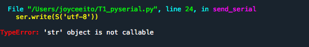
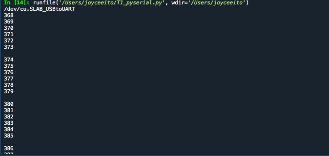
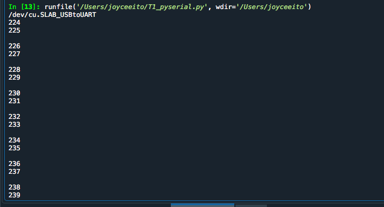
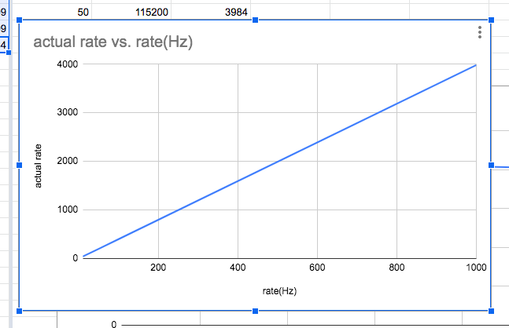
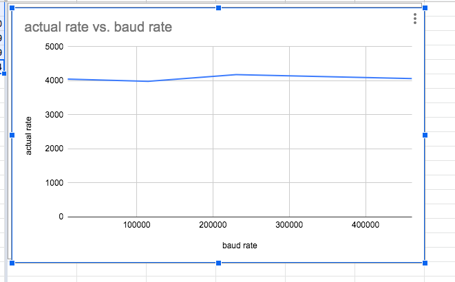
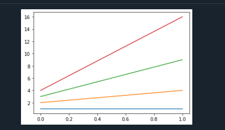
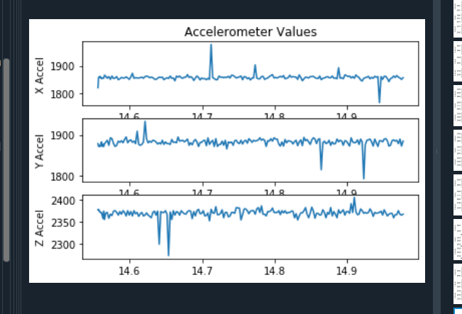

# Lab 3 Wireless Gesture Controlled Watch

## Tutorial 1: Pyserial - Connecting Arduino and Python

>Q1. Try running the code, but sending the message without the “.encode”... what happens? 

>A. Without the ".encode", I get an error saying the string can't decode and it also doesn't show up on the OLED. 
>>>

>Q2.Identify in the above code, (1) which Python command prints to Python’s own console, and (2) which Python command prints to the Serial port of the MCU?

>A. The python command that prints to Python's own console is print() and the Python comman that prints to the serial port of the MCU is ser.write(S.encode('utf-8')).

>Q3. What happens if you take out the “\n” in the string? Why?

>A. When I take out the "\n" in the string, the message doesn't pop up on the OLED.

>Q4. Describe the output you observe on the Python side?

>A. The output i've observe is that the numbers are being printed out 4 at a time.

>

>Q5. Change the code to read 10 bytes instead of 30. Now what do you get? What are the 10 bytes you received? Remove decode might help you understand

>A. The numbers are being printed out 2 at a time. 

>

>Q6. Describe the output you observe on the Python side? Is it the same as before? What does this tell you about the print() function of Python?

>A. The number shown is separated one part of the number per row. For example if the number were  12, it would be separated into a column of 1 2.

>Q7. We purposely made a few errors above. What were they? 

>A. The t in "try" shouldn't be capitalized. 

## Challenge 1:  Setting Your Watch to Send Data

>In this challenge, we set up the code on the arduino side to be able to send the data to python. First, we had to create a function called send_data() that prints out the accelerometer values and sample time only if the sample time is greater than the sampling delay. The calcSamplingDelay function is created to return the number of microseconds to wait between samples. Then we had to create a checkMessage function to make sure that it's receiving "send data" or "stop data" from python.

## Challenge 2: Reading Accelerometer Data

>In this challenge, we set up the python side to receive the data from the Arduino side. In order to do this we had to create several functions to receive the data, to read the bytes from the Serial, and to be able to print out the string received. After doing an example to get familiar with the concepts, I was able to complete the code to receive and print out the time and Accelerometer values from the serial monitor.

>Q1. What happens if you don’t decode the incoming char?

>A. if you don't decode the incoming char, the output will just be random symbols or not readable.

>Q2. Try removing the logic for checking if the data_array is empty and always vstack even if the data_array is empty. What is the error that gets thrown? Why?

>A. When I removed the logic, I get an error that the "utf-8" can't decode. And after I add the logic back in my code won't work anymore. 

>Q3. Try removing the 1 second delay on the MCU when starting data sending. Describe what happens?

>A. When I remove the one second delay, the data I receive is super out of place and unrealistic. The system probably gets overwhelemed with too many inputs too fast and an error will occur.

## Challenge 3: Calculate the Sampling Rate

>In this challenge, we modified out code from challenge 2 to calculate the sampling rate. To do this, we used the diff and mean functions to calculate the average sampling rate of 100 samples. The function calc_sampling_rate() is where we incorporated the diff and mean functions.  To modify the receive data function, we changed the while true to while sample_number<100. When we set up the functions in the main and ran the code, a calculated sampling rate was outputted.

>Q1. Start with a Baud rate of 115200. What is your calculated sampling rate when you set the sampling rate to 10Hz,50Hz,100Hz,1000Hz on the MCU. Make a plot (using a spreadsheet program) of the actual sampling rate (y-axis) vs expected sampling rate (x-axis).

>A. 

>Q2. How does this change with Baud rate 9600 vs 115200 vs 230400 vs 460800. For 1000Hz, make a plot of the actual sampling rate (y-axis) vs Baud Rate (x-axis).

>A. As the baud rate goes up, the actual sampling rate actually stays similar to each other. 
> 

>Q3. What happens if you use millis instead of micros for timing and Why?

>A. If you changed to millis instead of micros, the time will be a smaller number since millis is 10^3 and micros is 10^6. 

## Tutorial 2: Matplotlib

>Q. What was plotted? What does this tell you about how plt.plot interprets the input? Remember that a = [1, 2, 3, 4 ]
>         [1, 4, 9,16]

>A. There is a seperate line for the values that are located in the same index. Since 1 and 1 have the same index, they are plotted together on the same line, and same for the other values. 2 is with 4, 3 is with 9, and 4 is with 16. This tells me that the plt.plot interprets the input as all being "x" unless stated otherwise with plt.show(x,y).
>>A. 

## Challenge 4: Plotting Accelerometer Data
>In this challenge, I learned how to plot in python using the matplotlib.pyplot library. After learning about the plotting functions, I coded in python to plot the x,y and z accelerometer values.

>Deliverable: Show a gif of you starting your code, and end with the plot appearing. Also include a still image of the plot. 

>A. 
> 

## Challenge 5: Wireless Data Transmission
>In this challenge, we are supposed to send data from the Arduino to Python via bluetooth, plot the data, and then display the sampling rate onto the OLED. A battery is used to make sure the MCU is on.

>>A. 

## Challenge 6: Weather API & Creative Watchfaces
>In this challenge, we got familiar with the pyowm library and OpenWeatherMap in general. I chose the city Seattle because I was supposed to go there spring break but I couldn't because of covid19. The three different data I chose was temperature in celsius, sunrise time, and sunset time. I chose the temperature one because I was being basic, but I also chose sunrise and sunset time cause I was actually pretty amazed that I could display it on the OLED. 

> 
> 
