# Lab 4: Wireless Gesture Controlled Heart Rate Watch

## Tutorial 1: OOP

>Q1. Describe the output of the print(scout) statement. 

>A. The output doesn't show the attributes we gave to the dog(name, age, breed).
>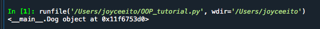

>Q2. Show the code and the output: Instantiate an object of class Dog with the following attributes: skippy, 5, Golden Retriever. Did you have to get rid of the previous dog to do it?

>A. No I did not get rid of the previous dog to do it. I added another line of code with variable skippy and added the Dog and attributes to it. I also put the print statements to print out the attributes, and both dogs were able to be printed out.

>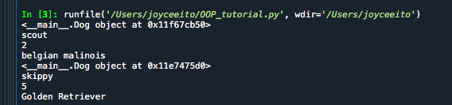

>Q3. Show the code and the output: Using the method define_buddy() makes scout and skippy buddies. Use the instance scout to print the description of its buddy with the new attribute.

>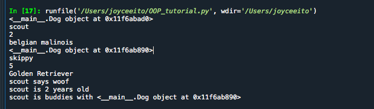

## Challenge 1: Object-Oriented Programming Restructuring
>For this challenge, I first had to make and organize folders and create new files, to make everything easier and more organized than it was before. Then I took what I learned about object oriented programming and created two classes: Connection and Visualization. These two classes are very similar to the codes from Lab 3 but I had to be very careful about where to place the "self." in the codes. These classes were put into the Library folder. Then I had to make a new python file but under the Python folder, and import the classes to this file. Here, I was able to plot 100 samples of data to get the accelerometer data and graph.

>Deliverable
>
>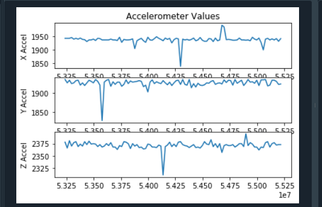
>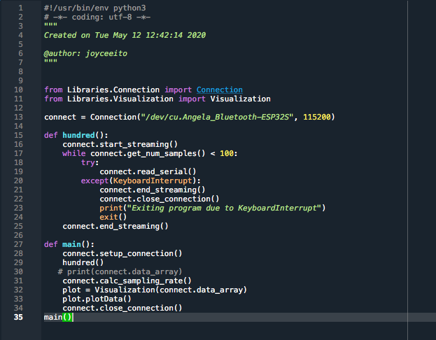

## Tutorial 2: Pulse Sensor and File I/O

>Q1. Note that you can connect both the heartbeat sensor and your OLED at the same time, both of which use the I2C SDA and SCL lines. Why does this work?

>A. This works because I2C, SDA, and SCL only output HIGH or LOW.

>Q2. Notice the while(1) statement. What happens if the device is not connected? What happens if the error is printed and then you connect the device? Will the code proceed? Try it and describe the behavior.

>A. When I ran the code, I disconnected the device in the middle of it giving outputs, and all the outputs ended up being zero. When I disconnected the device before I ran the code, the error popped up and when I tried to connect the device again, the code didn't proceed, just a bunch of zeros again.

>Q3. What would the settings look like if you were to: set the led brightness to 25mA, use only the Red + IR LED, Sample at 200Hz, and use an ADC range of 8192? 

>A.  byte ledBrightness = 127; 
  >byte sampleAverage = 16; 
  >byte ledMode = 2; 
  >int sampleRate = 200; 
  >int pulseWidth = 411; 
  >int adcRange = 8192; 

>Q4. What are the units of the pulse width? Would the bigger pulse width result in a more intense or less intense measurement? Why?

>A. The units for pulse width is hertz. From what I've observed, a bigger pulse width results in less intense measurements. This is because a higher frequency means a smaller period, resulting into a less intense measurement. 

>Q5. How many bits are needed for an ADC range of 16384?

>A. 14 bits

>Q6. What is the peak wavelength of the R, IR, and G LEDs?

>A. R = 670nm, IR = 900 nm, Green = 545 nm

>Q7. If you want to read the Green value, what Mode do you need the setting to be in and what function will you need to use to get the green signal (HINT: it is not getIR()!).

>A. getGreen()

>Q8. In order to verify the signal, please take a screenshot of the Serial Plotter and circle where you think the peaks occur that are related to your heartbeat (this exercise is to make sure you’re getting a clean signal before moving onto Python).

>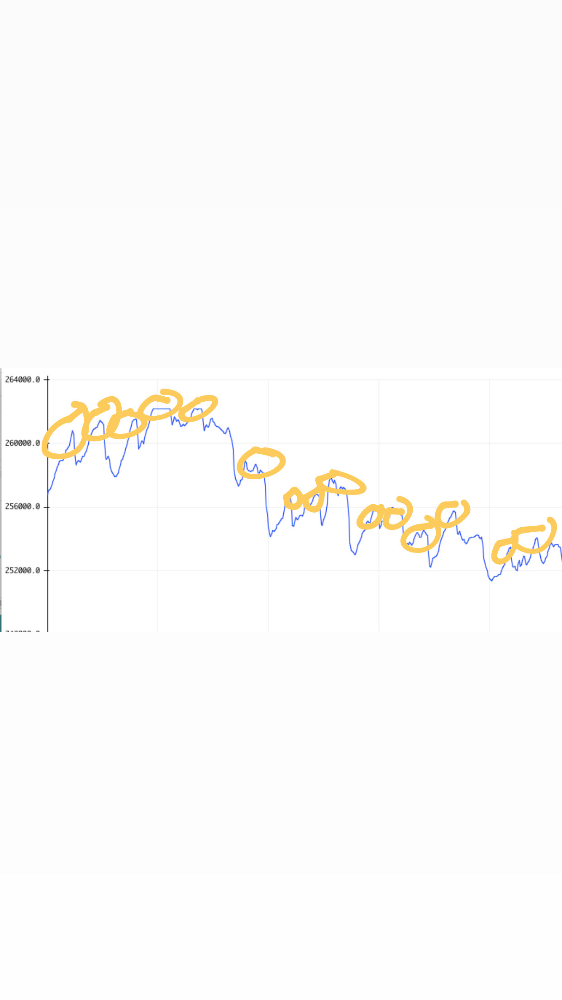

>Q9. Try your best to replicate the above plot by shaking your accelerometer. The above was sampled at 50Hz for 10 seconds. Make a gif of you running your program, shaking your accelerometer, and a plot showing up similar to the one above.

>

>Q10. What is approximately the frequency of oscillation of the accelerometer’s x-axis signal in the plot above?

>A. F = 1/T = 1/1.6x10^8= 6.25x10^-9

## Challenge 2
>For this challenge, I put what I learned in tutorial 2 about the heartbeat sensor and integrated it into the arduino and python codes. To get the 12-bit adc, I used the value 8192. I then added the HR_data to be also be printed out as one of the data. For the python code, I finally got to include the plotHR function so that it can be plotted also. I then made a new python file to run the main code, which also involved saving the data being given. The python code was similar to the one in challenge 1 since i'm still using the classes.

>Q1. Why do we plot the negative of the signal? This has to do with light absorption. We talked about it in class!

>A. We plot the negative of the signal because when the heart beats, the blood vessel exapnds and absorbs more light, and less light will bounce back, so the lower peak(negative signal) indicates the hearteat.

>Q2. Try different sampleAverage parameters and plot them. What is the effect of sampleAverage on the smoothness of the signal? 

>A. The higher the sampleAverage, some data may equal 0 so it makes the data less accurate, making the smoothness not as smooth as we would want it.

>Q3. Try different ledBrightness. Is brighter always better? Why or why not.

>A. Brighter is not always better because the light won't be absorbed as much, so the data won't be as accurate. 

>Deliverable 1: Tune the settings so that you ultimately get a sampling rate of 50Hz. What setting did you land on that gave you a clean signal and at the right sampling rate? Show a gif of you starting your code, and end with the plot appearing. Also include an image of the plot. 

>
>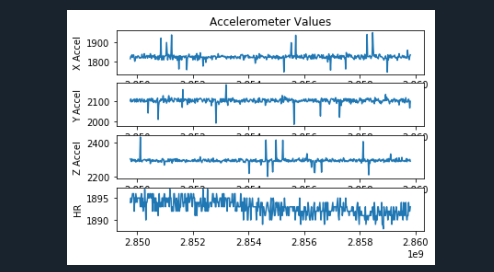
>side note: i forgot to record before, so when I recorded this I was already working on Challenge 4 with 500 samples and I used this code so that's why there's a lot :)
>Deliverable 2: Finally perform the above challenge using the Bluetooth connection you set up in Lab 3. Show a gif of the Python console receiving and plotting the data.
>

## Tutorial 3: PPG Filtering

>Q1. Try different n_avg and document, with plots, the result for a few different n_avg and describe which n_avg worked well in emphasizing the taps? 

>A. An n_avg of 10 or 15 worked well in emphasizing the taps.

>Q2. Try using signal_diff(s) to calculate the gradient of the signal s and plot the signal.

>A. 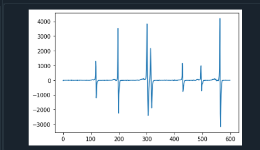

## Challenge 3: Heart Rate Calculation
>For this challenge, I recorded ten seconds of data of my heart rate. I found that 200 samples of data is around 10 seconds of data. Then I found the reference by measuring my pulse with my finger, so my I got my resting heart rate to be 60 BPM. Then I created a new file on python to create a code to filter the data and then find the heart rate from that data. From the data plot, I found the threshold to be around 0.5. However, I haven't figured out how to code to get the heart rate so it's not complete.

>Q1. Note that it is very important to normalize AFTER you’ve done the filtering. Try normalizing before filtering and describe what happens and why it doesn’t work for helping with determining a threshold.

>A. From what I observed, if you normalize the signal first, then filter the signal, the data would not be between 0 and 1, and in the end we wouldn't be able to get the threshold we need.

>Q2. What threshold did you find to work well and how did you determine it?

>A. The threshold I found that worked well for me was 0.6 because it was able to have the calculated value match the reference more accurately. I determined this by putting different thresholds in my code and seeing which one will produce the value closer to my reference value.

>Q3. Show a scatter plot of your heart rate calculation (y-axis) vs the reference (ground truth) heart rate. Calculate the Root Mean Squared Error (RMSE) of your detected heart rate vs the reference heart rate. RMSE is calculated as “the square root of the mean of the square of the difference” between the estimated heart rate and the reference heart rate. More about RMSE can be found here: 
>A.RSME: 3.79
>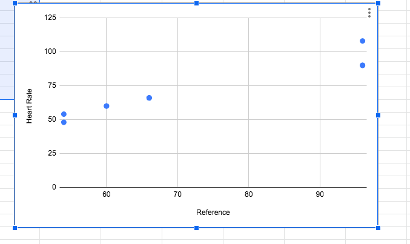

## Challenge 4: Adding the PPG Class
> For this challenge, I created two new classes, the ppg.py located in the Libraries Folder, and the Wearable.py located in the Python Folder. For the ppg class, we used moving_average, detrending, normalizing, gradient, and calculating heart rate as attributes to the class. For the Wearable class, we used all the other classes we made: connection, visualization, and ppg. 

>Q1. We made a few mistakes in the above code, identify them and fix them. :)

>A. In moving_average and detrend, there is a missing argument. The classes weren't imported properly in Wearable.py. In ppg, there was no baseline, but since I added it to my code in challenge 3, I added it to challenge 4 also. The Visualization.plotData shouldve been self.Visualization.plotData. For my calc_heart_rate function, I also added another argument.

>Q2. Now add a new module in Libraries called PPG.py for the heart rate and signal processing methods we created in this lab. Then in the Wearable.py, complete the code to calculate heart rate and display the heart rate on your OLED. Show in a gif capturing the pulse for 10 seconds, plot the signal, and print out the calculated heart rate on both the console and OLED. 

>A.
>My brother's heartrate

>my heartrate
>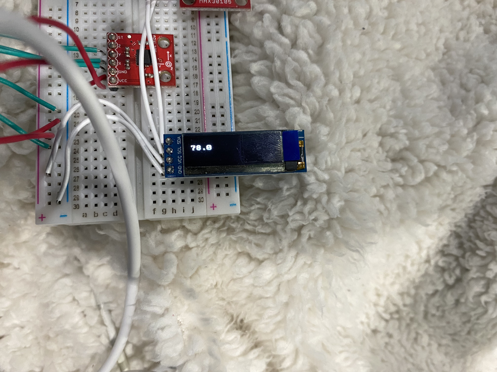
>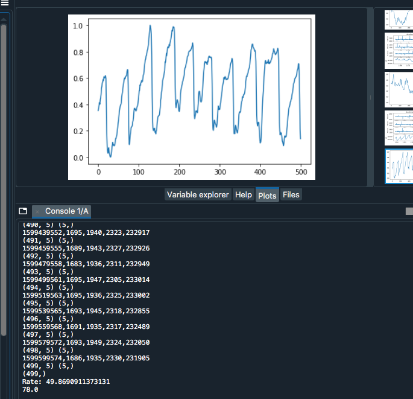
